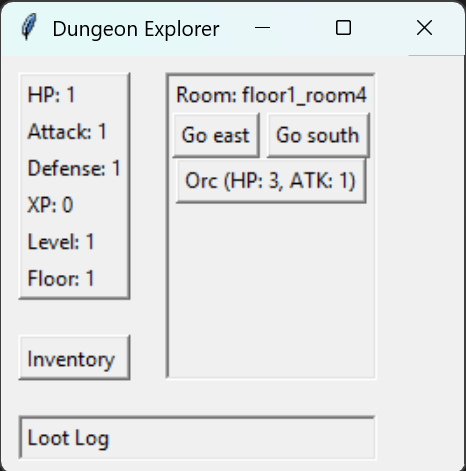
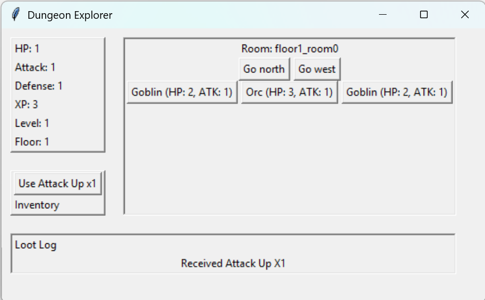
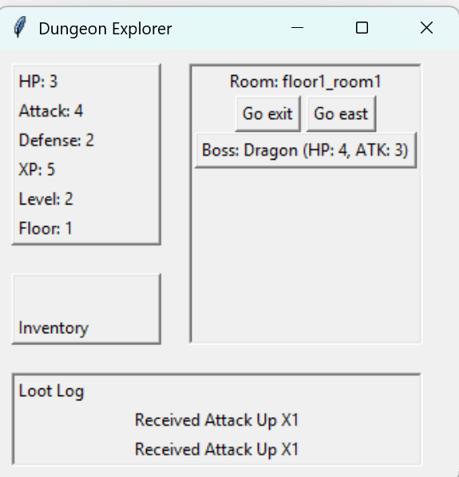
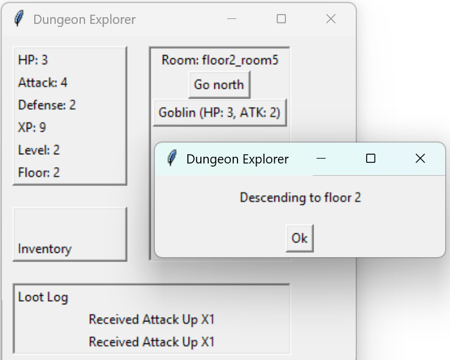
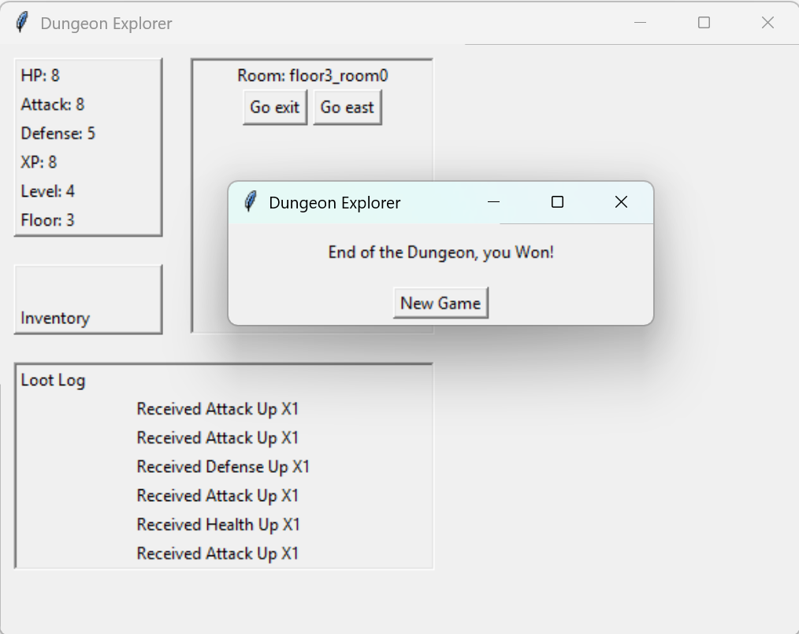

# Dungeon Explorer

**Dungeon Explorer** is a turn based dungeon crawler game with procedurally generated floors, rooms, enemies, loot, and bosses. The game features strategic exploration, combat, inventory management, and a save/load system, allowing players to explore dungeons floor by floor.


## Features

- **Procedurally Generated Dungeons**: Multiple floors with randomized rooms, starting and exit rooms, and a floor boss.
- **Combat Mechanics**: Turn-based fights against regular enemies and bosses.
- **Player Stats & Inventory**: Track health, experience, and items with a robust loot system.
- **Loot System**: Defeat enemies and explore rooms to collect items and gold.
- **Floor Bosses**: Bosses must be defeated to proceed to the next floor.
- **Save/Load System**: Save progress using h2 database.
- **Python GUI**: Interactive front-end using Tkinter to visualize player stats, inventory, and room navigation.
- **REST API**: Full backend implemented with Java Spring Boot for handling game logic and session management.
- **Docker**: To easily run the backend


## Gameplay

- **Navigation**: Move between rooms/floors using directional controls or API calls.

- **Combat**: Engage enemies in turn-based battles. Defeat an enemy to enhance stats or fight floor boss to unlock next floor.

- **Loot Collection**: Loot is generated per room and enemy; Room loot is generated and added to inventory when entering a room, enemy loot is generated and added to inventory when defeating an enemy.

- **Floor Progression**: Defeat the floor boss to unlock the exit to the next floor.

- **Game Over / Win Conditions**: If player health drops to zero, the game ends. Completing the final floor wins the game.


## API Endpoints (Backend)

- **POST** /game/new – Start a new game.

- **POST** /game/load – Load a saved game.

- **POST** /game/move – Move the player in a direction.

- **POST** /game/fight – Fight a specific enemy.

- **POST** /game/use-item – Use an item from inventory.


## Project Structure

- **Services**: Handle game mechanics such as movement, combat, loot, dungeon, and game engine logic.

- **Generators**: Generate dungeons, floors, rooms, enemies, bosses, and loot.

- **Orchestrator**: Handles new game creation, saving, and loading.

- **Template Registry**: Stores item, enemy, and boss templates.

- **Controllers**: REST API endpoints for game actions.

- **Frontend**: Python GUI to visualize game state and interact with the backend.

## UI
The project includes a lightweight Python Tkinter interface that acts as a visual client for the Java backend.  
It allows players to explore the dungeon, view player stats, manage inventory, and interact with rooms and enemies.

### How It Works
- Communicates with the backend via REST API calls using the `APIClient` class.
- All game logic (movement, combat, loot, dungeon generation) is handled by the backend; the UI only displays state and triggers actions.

### UI Components
- **Player Stats Panel** — Shows HP, Attack, Defense, XP, Level and Floor number.
- **Inventory Panel** — Displays items in inventory as buttons that can be pressed to use them.
- **Room Panel** — Shows the current room, available exits (movement buttons), and enemies (fight buttons).
- **Loot Log** — Displays recent loot gained, up to the last 10 messages.

### Features
- Real-time updates after movement, combat, or item usage.
- Manual start of a new game when the player dies or completes the dungeon with new game button.
- Clear separation of player data, room state, and loot logs.
- Modular design for easy extension with new UI elements.

### Screenshots

#### Game Start state


#### Game Multiple Enemies


#### Game Boss Room


#### Game Floor Movement


#### Game Won


## Installation & Setup

1. **Clone the repository**
   ```bash
   git clone 
   cd dungeon-explorer
   ```

2. **Backend Setup with Docker**
   This starts the Spring Boot API and creates a local volume for your save files.
   ```bash
   docker-compose up --build
   ```
   The backend will be live at http://localhost:8080

3. **Frontend Setup**

   - Ensure Python 3.x is installed.

   - Run the GUI at game_ui subfolder:
      ```bash
      python game_loop.py
      ```
4. **The GUI** will interact with the backend automatically through REST API calls.
   
5. **View databse**:
   You can inspect the game info directly via the H2 Console:

   **URL**: http://localhost:8080/h2-console

   **JDBC URL**: jdbc:h2:file:./data/dungeon_db

   **User**: sa | Password: password

## Tech Stack

- **Backend**: Java 17, Spring Boot, Eclipse Temurin (Docker Base).
- **Frontend**: Python, Tkinter.
- **Database**: Database: H2 Database (File-based).
- **Persistence**: Game sessions are serialized to JSON and stored in H2, with data persisted across restarts via Docker Volumes.
- **Build Tool**: Maven.
- **Testing**: JUnit 5, Mockito (with Repository Mocking and ObjectMapper stubbing).


## Created by
Idan Daniel

