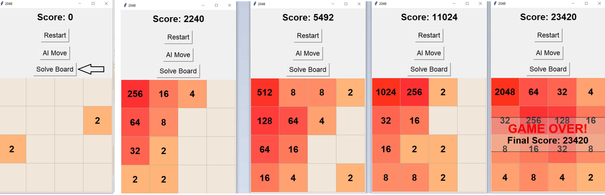

# 🕹️ 2048 AI Solver

A Python project implementing the 2048 game with AI solvers and GUI for manual and automatic play.

---

# UI Example
Example for Solve Board with Expectimax solver in UI:

## Features
 - Playable 2048 game with GUI
 - **AI Solvers:**
   - **Heuristic Solver:**  Uses weighted evaluation of board state (game score, empty tiles, merges, monotonicity, and corner strategy) to choose moves.
   - **Expectimax Solver:** Search-based AI using a depth-limited Expectimax algorithm. It simulates a few moves ahead and chooses the current move that maximizes the expected score.
 - **Unit Testing:** for the game logic and solvers
 - **Batch Comparison:** Run multiple games automatically to measure AI performance.
---

## Project Workflow

1. **Game Implementation**
   - Developed the 2048 game logic (`Board` class) including tile spawning, movement, and score tracking.
   - Added a simple GUI (`game_ui.py`) to play manually and visualize AI decisions.

2. **Heuristic Solver**
   - Designed weighted evaluation function considering empty cells, potential merges, monotonicity, and corner strategy.
   - Tuned weights through batch testing to maximize strategy.
   - Tested solver performance on hundreds of simulated games.

3. **Expectimax Solver**
   - Implemented depth-limited Expectimax algorithm for AI decision-making.
   - Tested at depth 2 for practical computation times.

4. **Comparison & Evaluation**
   - Created `comparison_script.py` to run batch tests and compare solvers.
   - Measured metrics: average score, max score, max tile.

5. **Testing**
   - Unit tests for core game logic (`tests/test_board.py`).
   - Integration tests for core game logic (`tests/test_board_integration.py`).
   - Solver-specific tests (`tests/test_heuristic_solver.py`, `tests/test_expectimax_solver.py`).

6. **Optimization**
   - Adjusted heuristic weights for best performance.
   - Limited Expectimax depth to avoid long computation times.
   - Used multiprocessing for batch testing of AI solvers.
   ---

   ## Getting Started
   1. Clone the repository: git clone https://github.com/Idandaniel2349/developer-portfolio.git
   2. Navigate to the project folder: cd developer-portfolio/PythonProjects/2048-solver
   3. Run the 2048 GUI (manual or AI play):
   **python main.py**
   4. Run batch comparison of solvers:
   **python comparison_script.py**
---

## AI Solver Comparison
| Solver               | Average Score | Max Score | Max Tile |
| -------------------- | ------------- | --------- | -------- |
| Heuristic            | 10,124        | 35,968    | 2048     |
| **Expectimax (depth 2)** | 25,969        | 76,548    | 4096     |

- Heuristic solver is fast and lightweight.
- Expectimax achieves higher scores but is computationally heavier.
- Expectimax is used in the GUI game run for better results.

## Testing Weights (Heuristic Solver)

The heuristic solver allows tuning of the following weights:

| Weight           | Value | Description                                           |
|-----------------|-------|-------------------------------------------------------|
| `weight_score`    | 0.5   | Importance of current game score                     |
| `weight_empty`    | 3     | Importance of empty cells                             |
| `weight_monotonicity` | 1.2   | Board monotonicity (favor ordered tiles)             |
| `weight_merges`   | 5     | Potential merges (reward positions that can merge)  |
| `weight_corner`   | 3     | Reward for keeping the largest tile in the corner   |

This weights values configuration produced the best balance between average score and max tile results in batch testing

---

## Tech Stack

- **Language:** Python 3.12
- **GUI:** Tkinter
- **AI Algorithms:** 
  - Heuristic evaluation
  - Expectimax search
- **Testing:** unittest
- **Multiprocessing:** Python standard `multiprocessing` module