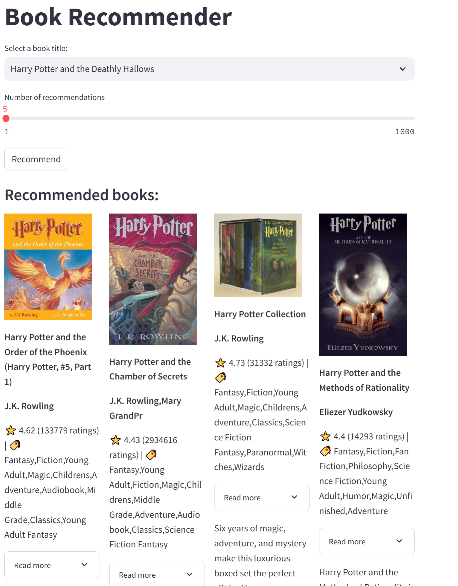

# 📚 Book Recommender

A Python-based book recommendation system with an interactive web UI built using **Streamlit**.  
It recommends books based on **text similarity**, **genre similarity**, and **ratings/popularity(total ratings)**.

---

## Features

- **Data Cleaning & Preprocessing** pipeline for reproducible datasets.
- **Content-based recommendations** using TF-IDF similarity and genres.
- **Rating & Popularity integration** to balance quality and user interest.
- **Interactive Streamlit UI** with book covers, ratings, genres, and expandable descriptions.

---
## Project Workflow

This project is structured into four main parts:

1. **`clean_dataset.ipynb`**  
   - Jupyter Notebook for **initial dataset exploration & cleaning**.  
   - Receives the raw dataset books.csv
   - Handles missing values, inconsistent formats, and prepares raw data for preprocessing.  
   - Produces a clean dataset ready for feature engineering called cleaned_books.csv 

2. **`preprocess.py`**  
   - Prepares data for recommendations:  
     - Builds the **TF-IDF matrix** from book descriptions.  
     - Encodes genres with **one-hot encoding**.  
     - Normalizes ratings & popularity(total ratings).  
   - Saves processed artifacts (e.g., book_data, tfidf_norm, genres_one_hot) for reuse.  

3. **`recommender.py`**  
   - Core recommendation engine.  
   - Computes similarity using:  
     - **Text similarity** (cosine similarity on TF-IDF)  
     - **Genre similarity** (with cosine similarity on the genres_one_hot) 
     - **Rating/popularity score**  
   - Combines results with adjustable weights to return top recommendations.  

4. **`book_recommender_app.py`**  
   - **Streamlit app** for user interaction.  
   - Features:  
     - Search or select a book title  
     - Configurable number of recommendations  
     - Display book covers, title, genre, rating, rating count  
     - Expandable book description  

* The `data/` folder contains datasets and preprocessed files required by the project
* `requirements.txt` contains all Python libraries required to run the project.
* scripts have already been run; the necessary data is included.
* book dataset was taken kaggle "GoodReads 100k books" and trimmed to 92k books and only relevant columns to fit git size restriction

---

## Getting Started

1. Clone the repository:
   
git clone https://github.com/Idandaniel2349/developer-portfolio.git

2. Navigate to the project folder:
cd developer-portfolio/PythonProjects/BookRecommander

3. Install dependencies:
pip install -r requirements.txt

4. Run the Streamlit app:
streamlit run book_recommender_app.py

## Tech Stack

- **Python 3.x**
- **pandas, numpy** – Data cleaning & preprocessing
- **scikit-learn** – TF-IDF, normalization, similarity calculations
- **Streamlit** – Interactive UI

## UI example

